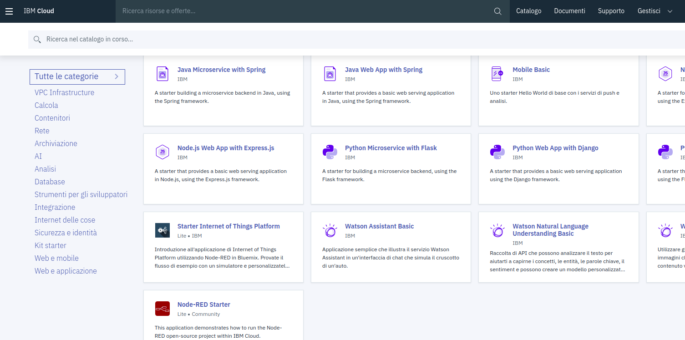
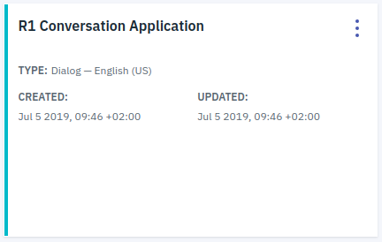
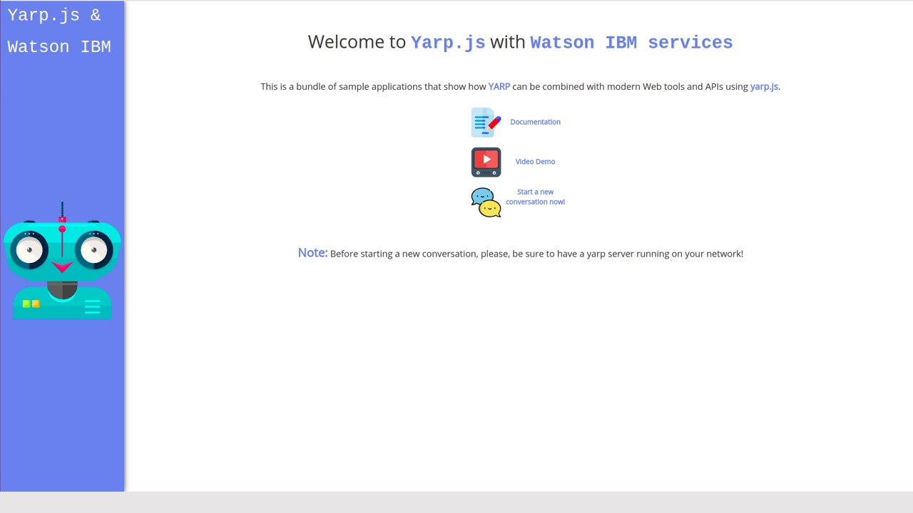

# Watson Assistant Application with Yarp.js.

The main purpose of this repository is to create a human-robot interaction based on conversation.

*   [Introduction](#introduction)
*   [Set up your system](#SetUpYourSystem)
    *   [Watson Assistant](#WatsonAss)
        *   [Before you begin](#BeforeBegin)
            *   [Installing locally](#InstallLocally)
            *   [Setting up the Watson Assistant service](#SettingUpWatson)
            *   [Importing the Watson Assistant workspace](#Importing)
            *   [Configuring the app environment](#ConfEnvirApp)
*   [Installing and starting the app](#InstallStartApp)
*   [Deploying to IBM Cloud](#DeployingApp)
    *   [Troubleshooting](#Troubleshooting)
*   [License](#License)

# Introduction

We exploit the IBM Cloud that allows building a simple application in which several services communicate among them, in particular:

* [Watson Assistant Conversation](https://watson-assistant-demo.ng.bluemix.net/) allows creating a fluent dialog flow. The unidirectional dialog flow is composed by nodes of the conversation which are activated through entities and intents of the colloquy.   

* [Speech To Text](https://speech-to-text-demo.ng.bluemix.net/) uses speech recognition capabilities to convert speech into text.

* [Text To Speech](https://text-to-speech-demo.ng.bluemix.net/) directly converts text into speech with a custom voice language.

* [Visual Recognition](https://www.ibm.com/watson/services/visual-recognition/demo/#demo) is able to recognize entities within an image.

We used an [IBM demo](https://github.com/watson-developer-cloud/car-dashboard) as a starting point.

[Yarp](https://github.com/robotology/yarp) (Yet Another Robot Platform) is the network that allows sending/receiving data through ports.
The core of this repository, [Yarp.js](https://github.com/robotology/yarp.js/blob/master/README.md), is a JavaScript set of bindings for YARP written by Carlo Ciliberto.

# Video

# Set up your system

Firstly, clone [Yarp.js](https://github.com/robotology/yarp.js/blob/master/README.md) locally.

**Client dependencies (on any device on your network)**:

*   [Google Chrome](https://www.google.com/chrome/)
*   [Firefox](https://www.mozilla.org/en-US/firefox/products/)

**Server dependencies**:

*   [YARP](https://github.com/robotology/yarp) (Duh!). With OpenCV!
*   [node.js](https://nodejs.org/en/). Version >= 4.2.2\. Follow the [official guide](https://nodejs.org/en/download/package-manager/).

**Note**:

*   **Please make sure** that your Node version is >= 4.2.2
*   **Linux**. If you installed Node.js from the package manager, it could happen that the command `node` is not in your path, but rather `nodejs` is. To this end, run `$> sudo ln -s /usr/bin/nodejs /usr/bin/node`.

Once you have all dependencies installed, go to the folder where you have cloned this repository and run:

    $> sudo npm install
    $> ./node_modules/cmake-js/bin/cmake-js

**Optional**: although the command `sudo npm install` installs the node dependencies _locally_, it needs administrative permissions. If you want to avoid this (and just use `npm install`), follow the [official npm guide](https://docs.npmjs.com/getting-started/fixing-npm-permissions). This is not required to use yarp.js though.

## Watson Assistant

[IBM Watson™ Assistant](https://console.bluemix.net/docs/services/conversation/getting-started.html#gettingstarted) allows the conversation flow with an end user by using intents, entities and dialog nodes in a simple chat interface. With the IBM Watson™ Assistant service, you can build a solution that understands natural-language input and uses machine learning to respond to users in a way that simulates a conversation between humans.

This Node.js app demonstrates the Watson Assistant service in a simple chat interface simulating a natural conversation.

### Before you begin

*   Create an IBM Cloud account
    *   [Sign up](https://console.ng.bluemix.net/registration/?target=/catalog/%3fcategory=watson) in IBM Cloud, or use an existing account. Your account must have available space for at least 1 app and 1 service.
*   Make sure that you have the following prerequisites installed:

    *   The [Node.js](https://nodejs.org/#download) runtime, including the [npm][npm_link] package manager
    *   The [Cloud Foundry](https://github.com/cloudfoundry/cli) command-line client

        Note: Ensure that you Cloud Foundry version is up to date

#### Installing locally

If you want to modify the app or use it as a basis for building your own app, install it locally. You can then deploy your modified version of the app to IBM Cloud ([Deploying to IBM Cloud](#DeployingApp)).

#### Setting up the Watson Assistant service

You can use an exisiting instance of the Watson Assistant service. Otherwise, follow these steps.

1.  At the command line, go to the local project directory (`yarp.js/WatsonAssistant`).

2.  Connect to IBM Cloud with the Cloud Foundry command-line tool (Cloud Foundry [documentation](https://docs.cloudfoundry.org/)). For more information, see the Watson Developer Cloud [documentation](https://console.bluemix.net/developer/watson/documentation).

         cf login

3.  Enter your Cloud Foundry credentials:

         Email> YourMail@example.com

         Password> YourPassword

    You should be able to see this kind of outcome:

         Authenticating...
         OK

         Targeted org YourMail@example.com

         Targeted space dev

         API endpoint:   https://api.eu-gb.bluemix.net (API version: 2.92.0)
         User:           YourMail@example.com
         Org:            YourMail@example.com
         Space:          dev

4.  Create an instance of the Watson Assistant service in IBM Cloud (our CLI is being updated, for now, use the `create-service` conversation command). For example:

         cf create-service conversation free my-watson-assistant-service

    

    #### Importing the Watson Assistant workspace

5.  In your browser, navigate to your [IBM Cloud console](https://console.ng.bluemix.net/dashboard/apps).

6.  From the **All Items** tab, click the newly created Watson Assistant service **"my-watson-assistant-service"** in the **Services** list.

    

7.  On the Service Details page, click **Launch tool**.

8.  Click the **Import workspace** icon in the Watson Assistant service tool. Specify the location of the workspace JSON file in your local copy of the app project:

    `<project_root>/WatsonAssistant/training/Yarp-IBM.json`

9.  Select **Everything (Intents, Entities, and Dialog)** and then click **Import**. The car dashboard workspace is created.

#### Configuring the app environment

1.  Show hidden files (Ctrl+H) and search for `.env.example` file.

2.  Copy or rename the `.env.example` file to `.env` (nothing before the dot).

3.  Create a service key in the format `cf create-service-key <service_instance> <service_key>`. For example:

         cf create-service-key my-watson-assistant-service myKey

4.  Retrieve the credentials from the service key using the command `cf service-key <service_instance> <service_key>`. For example:

         cf service-key my-watson-assistant-service myKey

    The output from this command is a JSON object, as in this example:

         {
           "password": "XXxXXxxxxXXx",
           "url": "https://gateway.watsonplatform.net/conversation/api",
           "username": "xxXXXXxX-xXxX-XXXX-XXXX-xXxXXxXXxXXX"
         }

5.  Paste the `password` and `username` values (without quotation marks) from the JSON into the `ASSISTANT_PASSWORD` and `ASSISTANT_USERNAME` variables in the `.env` file. For example:

         ASSISTANT_USERNAME=xxXXXXxX-xXxX-XXXX-XXXX-xXxXXxXXxXXX
         ASSISTANT_PASSWORD=XXxXXxxxxXXx

6.  In your [IBM Cloud console](https://console.ng.bluemix.net/dashboard/apps), open the Watson Assistant service instance where you imported the workspace.

7.  Click the menu icon in the upper-right corner of the workspace tile, and then select **View details**.

    

8.  Copy the workspace ID to the clipboard.

9.  On the local system, paste the workspace ID into the WORKSPACE_ID variable in the `.env` file. Save and close the file.

# Installing and starting the apps

1.  Throughout, we will assume that a YARP server is running. If that's not your case, run `$> yarp server` on a machine where YARP is installed.

2.  Go into `yarp.js/WatsonAssistant` folder.

3.  Install the demo app package into the local Node.js runtime environment:

         npm install

4.  Start the app:

         npm start

5.  Point your browser to [http://localhost:3000](http://localhost:3000) to try out the app and open the Yarp ports.

6.  In another terminal, check if the ports are opened ("ibmjs/send:o" and "ibmjs/receive:i") :

         yarp name list

7.  Go back to `yarp.js` folder.

8.  Recently, Google Chrome has changed its privacy settings, requiring applications that access the device microphone or camera to run from a secure origin (HTTPS). We have provided a self-signed certificate to run local applications from an HTTPS domain rather than HTTP, therefore circumventing this issue. **However we have not yet determined whether the HTTPS will introduce latencies in yarp.js data transmission**.

    To start the "secure" yarp.js server, simply run:

         $> node examples/examples_https.js

    then go to:

         https://your.machine.ip.address:3000  // <--- mind the https at the beginning!!

    **Note**. Mind the _https_ in the beginning you cannot use `localhost` in place of `your.machine.ip.address`

    You should get a **warning**, telling you that "your connection is not private". Click on the link `Advanced` and then `Proceed to (address)`.

    You should now be able to see the usual starting page of yarp.js examples. But you are now running on HTTPS!

    Open the browser on any device connected to your network and go to the address

         your.machine.ip.address:3000
         // Please *do not use* localhost:3000 (although it works if you are on the same machine where you run the examples.js script).

    (You can get your device ip by typing `$> ifconfig` on a shell on the machine where the examples is running). You should see a webpage like the one below

    

    The available examples will be shown in the header.

9.  Click on **Message IBM** example and check if the ports are opened ("yarpjs/send:o" and "yarpjs/receive:i") :

         yarp name list

10.  You should obtain this outcome (all the ports opened):

         registration name /ibmjs/receive:i ip xxx.xxx.xx.xxx port 10003 type tcp
         registration name /ibmjs/send:o ip xxx.xxx.xx.xxx port 10005 type tcp
         registration name /yarpjs/receive:i ip xxx.xxx.xx.xxx port 10002 type tcp
         registration name /yarpjs/send:o ip xxx.xxx.xx.xxx port 10004 type tcp
         *** end of message

# Deploying to IBM Cloud

You can use Cloud Foundry to deploy your local version of the app to IBM Cloud.

1.  In the project root directory, open the `manifest.yml` file:

    *   In the `applications` section of the `manifest.yml` file, change the `name` value to a unique name for your version of the demo app.
    *   In the `services` section, specify the name of the Watson Assistant service instance you created for the demo app. If you do not remember the service name, use the `cf services` command to list all services you have created.

    The following example shows a modified `manifest.yml` file:

        ---
        declared-services:
        my-watson-assistant-service:
          label: conversation
          plan: free
        applications:
        - name: watson-assistant-simple
        command: npm start
        path: .
        memory: 256M
        instances: 1
        services:
        - my-watson-assistant-service
        env:
          NPM_CONFIG_PRODUCTION: false

2.  Push the app to IBM Cloud:

        cf push

    Access your app on IBM Cloud at the URL specified in the command output.

## Troubleshooting

If you encounter a problem, you can check the logs for more information. To see the logs, run the `cf logs` command:

    cf logs <application-name> --recent

# License

Material included in yarp.js is released under the terms of the LGPLv3.
